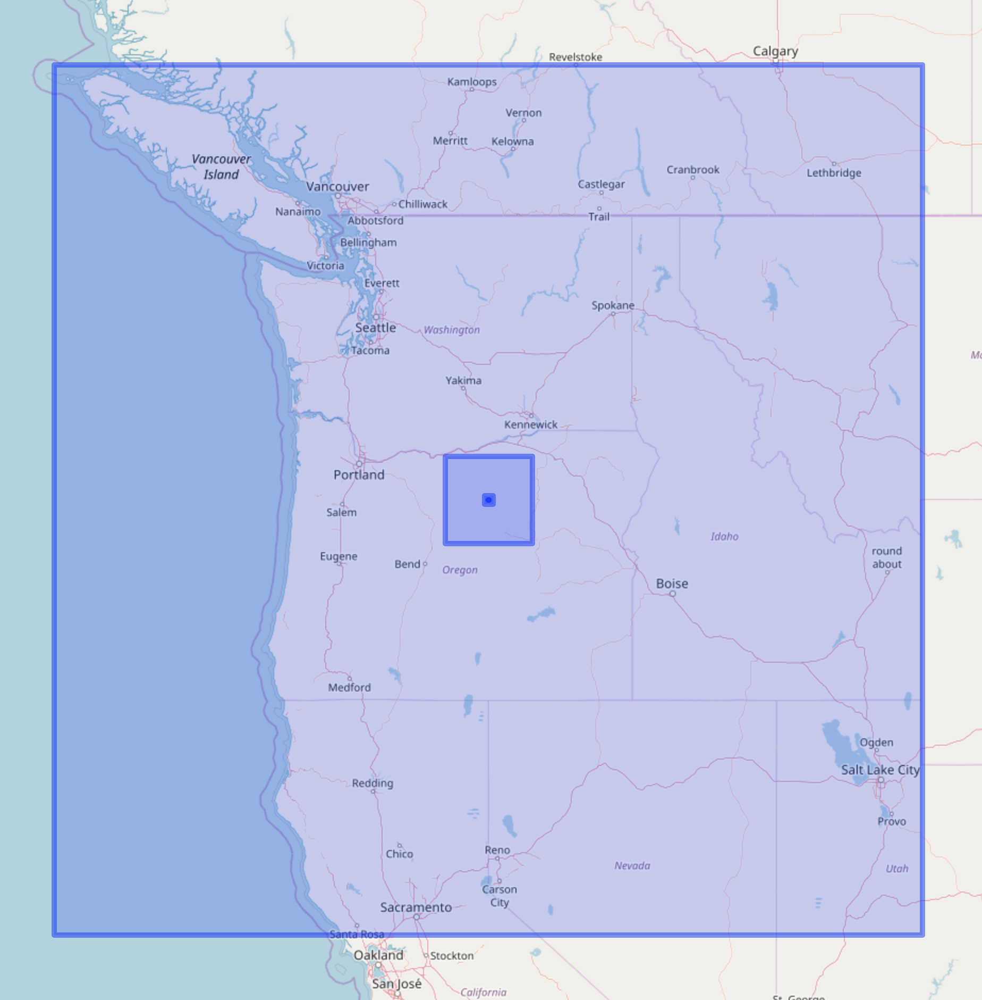

bbox
====

```{r echo=FALSE}
knitr::opts_chunk$set(
  comment = "#>",
  collapse = TRUE,
  warning = FALSE,
  message = FALSE
)
```

[](http://www.repostatus.org/#wip)
[](https://travis-ci.org/ropensci/bbox)
[](https://codecov.io/gh/ropensci/bbox)

`bbox` gets bounding boxes

Various interfaces:

* Input long/lat and value to make a polyogn, then get the bbox, using either
    * `sp`/`rgeos`, or
    * GeoJSON via `lawn` (to be replaced with `geoops` once `geoops::geo_buffer`)
* Input Spatial objects (`sp` package) and spit out the bbox
* Input GeoJSON data and spit out the bbox
* Input Well Know Text data and spit out the bbox
* Input Simple Features (`sf` package) data and spit out the bbox


## Installation

```{r eval=FALSE}
remotes::install_github("ropensci/bbox")
```

```{r}
library("bbox")
```

## lon/lat to bbox

```{r}
lonlat2bbox(lon=-120, lat=45, width=10^4)
```

## get bbox from any spatial object

sp/rgeos class spatial objects

```{r}
library(sp)
x <- GridTopology(c(0,0), c(1,1), c(5,5))
sp_grid <- SpatialGrid(x)
b_box(sp_grid)
```

WKT

```{r}
wkt_poly <- "POLYGON ((100.001 0.001, 101.1235 0.0010, 101.001 1.001, 100.001 0.001))"
b_box(wkt_poly)
```

## visualize bbox'es

```{r eval=FALSE}
library(leaflet)
viz_bbox <- function(map, x) addRectangles(map, x[1], x[2], x[3], x[4])
leaflet() %>% 
    addTiles() %>% 
    viz_bbox(lonlat2bbox(lon=-120, lat=45, width=10)) %>% 
    viz_bbox(lonlat2bbox(-120, 45, 100)) %>%         
    viz_bbox(lonlat2bbox(-120, 45, 1000)) %>% 
    viz_bbox(lonlat2bbox(-120, 45, 10^4)) %>% 
    viz_bbox(lonlat2bbox(-120, 45, 10^5)) %>% 
    viz_bbox(lonlat2bbox(-120, 45, 10^6))
```



## Meta

* Please [report any issues or bugs](https://github.com/ropensci/bbox/issues).
* License: MIT
* Get citation information for `bbox` in R doing `citation(package = 'bbox')`
* Please note that this project is released with a [Contributor Code of Conduct](CODE_OF_CONDUCT.md).
By participating in this project you agree to abide by its terms.
